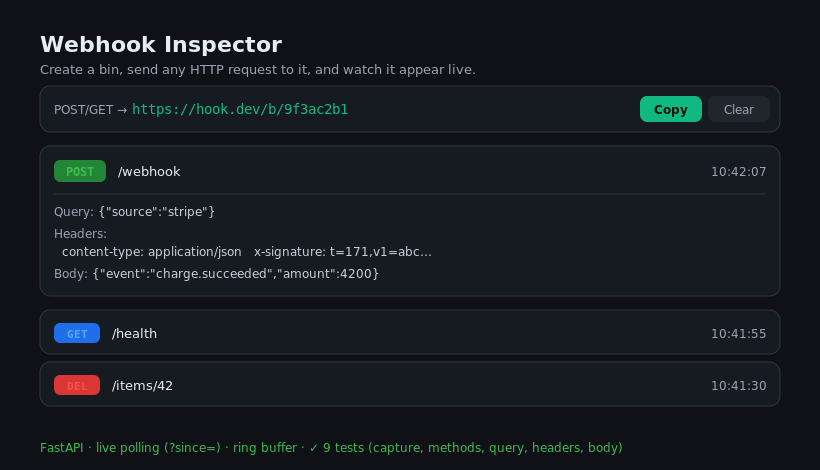

# Webhook Inspector

[](https://github.com/JCreatesGH/webhook-inspector/actions)
[](https://www.python.org/)
[](LICENSE)

A self-hostable "requestbin": generate a throwaway URL, point any webhook or HTTP client at it, and watch requests stream into a live UI — method, path, query, headers, and body. Genuinely useful for debugging Stripe/GitHub/Slack webhooks locally.



## Run it

```bash
pip install -r requirements.txt
uvicorn app.main:app --reload      # http://localhost:8000
# or
docker build -t inspector . && docker run -p 8000:8000 inspector
```

Open the page, copy your bin URL (`/b/<id>`), then fire a request:

```bash
curl -X POST localhost:8000/b/<id>/webhook?source=stripe \
     -H 'X-Signature: abc' -d '{"event":"charge.succeeded"}'
```

It appears in the UI within ~1.5s.

## API

| Method | Route | Purpose |
|--------|-------|---------|
| `POST` | `/api/bins` | create a bin → `{ bin_id }` |
| `ANY`  | `/b/{bin_id}/...` | capture a request (any method/path); returns 200 (or the bin's configured response) |
| `GET`  | `/api/bins/{id}/requests?since=N` | poll for new captured requests |
| `DELETE` | `/api/bins/{id}/requests` | clear the bin |
| `GET` / `PUT` / `DELETE` | `/api/bins/{id}/response` | read / set / reset the bin's canned response |

### Simulate an endpoint

Point a webhook at your bin and make it answer however you need — a `503`, a custom JSON payload, a specific content-type:

```bash
curl -X PUT localhost:8000/api/bins/<id>/response \
     -H 'Content-Type: application/json' \
     -d '{"status":503,"body":"down for maintenance","content_type":"text/plain"}'
```

The request is still captured; the sender just gets your configured response back.

## Design

- **`BinStore`** is an in-memory, **bounded ring buffer** per bin (oldest requests drop off) with monotonic request IDs — so the front end can poll with `?since=` and only fetch new ones. It's pure and unit-tested.
- **Bounded memory** — bins are **LRU-evicted** past `max_bins` (no leak from abandoned bins), and each captured body is **truncated to `max_body`** (flagged with `truncated: true`).
- The capture route accepts every common method via a single `api_route`, recording method, path, query, headers, client IP, and decoded body with a UTC timestamp.

## Development

```bash
python -m pytest -q   # 16 tests (store + API: capture, canned responses, LRU/truncation, methods, polling)
```

## License

MIT
